# 🔄 WhiteLabelPortal Deployment Flowchart

## Visual Deployment Process

```mermaid
graph TB
    Start([Start Deployment]) --> LocalPrep[Local Preparation]
    
    LocalPrep --> CheckFiles{All files ready?}
    CheckFiles -->|No| FixFiles[Fix missing files]
    FixFiles --> CheckFiles
    CheckFiles -->|Yes| BuildLocal[Build Locally: npm run build]
    
    BuildLocal --> BuildSuccess{Build successful?}
    BuildSuccess -->|No| FixBuild[Fix build errors]
    FixBuild --> BuildLocal
    BuildSuccess -->|Yes| CreatePackage[Create deployment package]
    
    CreatePackage --> cPanelSetup[cPanel Setup]
    
    cPanelSetup --> CreateDB[Create MySQL Database]
    CreateDB --> CreateUser[Create DB User]
    CreateUser --> GrantPrivileges[Grant ALL PRIVILEGES]
    
    GrantPrivileges --> EnableNodeJS[Enable Node.js App]
    EnableNodeJS --> ConfigureApp[Configure App Settings]
    
    ConfigureApp --> UploadFiles[Upload Files to Server]
    
    UploadFiles --> UploadMethod{Upload method?}
    UploadMethod -->|Git| GitClone[Clone from repository]
    UploadMethod -->|FTP| FTPUpload[Upload via FTP]
    UploadMethod -->|File Manager| FileManager[Upload & extract zip]
    
    GitClone --> SSHAccess[Access via SSH/Terminal]
    FTPUpload --> SSHAccess
    FileManager --> SSHAccess
    
    SSHAccess --> NavigateDir[cd /home/username/whitelabelportal]
    NavigateDir --> RunQuickDeploy[./quick-deploy.sh]
    
    RunQuickDeploy --> InstallDeps[npm install]
    InstallDeps --> BuildServer[npm run build]
    BuildServer --> Migrations[npm run db:push]
    
    Migrations --> UpdateEnv[Update .env file]
    UpdateEnv --> SetEnvVars[Set cPanel Environment Variables]
    
    SetEnvVars --> UpdateOAuth[Update Google OAuth Redirect URI]
    UpdateOAuth --> StartApp[Start Node.js App in cPanel]
    
    StartApp --> AppRunning{App running?}
    AppRunning -->|No| CheckLogs[Check error logs]
    CheckLogs --> FixErrors[Fix errors]
    FixErrors --> StartApp
    
    AppRunning -->|Yes| TestEndpoints[Test Endpoints]
    
    TestEndpoints --> TestFrontend{Frontend loads?}
    TestFrontend -->|No| FixFrontend[Fix frontend issues]
    FixFrontend --> TestFrontend
    
    TestFrontend -->|Yes| TestAPI{API works?}
    TestAPI -->|No| FixAPI[Fix API issues]
    FixAPI --> TestAPI
    
    TestAPI -->|Yes| TestAuth{Auth works?}
    TestAuth -->|No| FixAuth[Fix auth issues]
    FixAuth --> TestAuth
    
    TestAuth -->|Yes| TestDB{Database works?}
    TestDB -->|No| FixDB[Fix database issues]
    FixDB --> TestDB
    
    TestDB -->|Yes| FinalTests[Run All Tests]
    
    FinalTests --> AllPassed{All tests passed?}
    AllPassed -->|No| Debug[Debug and fix]
    Debug --> FinalTests
    
    AllPassed -->|Yes| SetupMonitoring[Setup Monitoring]
    SetupMonitoring --> ConfigBackups[Configure Backups]
    ConfigBackups --> Success([Deployment Complete!])
    
    style Start fill:#90EE90
    style Success fill:#90EE90
    style BuildLocal fill:#FFE4B5
    style RunQuickDeploy fill:#FFE4B5
    style StartApp fill:#87CEEB
    style FinalTests fill:#DDA0DD
```



## Decision Points Explained

### 1. Upload Method Selection
- **Git (Recommended):** Best for version control and easy updates
- **FTP:** Good for one-time uploads, slower for large files
- **File Manager:** Easy for beginners, suitable for smaller projects

### 2. Troubleshooting Branches
Each "No" path leads to specific troubleshooting:

#### Frontend Issues
- Check `dist/public/` directory exists
- Verify `.htaccess` rules
- Check file permissions (755 for dirs, 644 for files)

#### API Issues
- Verify Node.js version (18+)
- Check environment variables
- Review `dist/index.js` exists

#### Auth Issues
- Verify Google OAuth redirect URI
- Check `GOOGLE_CLIENT_ID` and `GOOGLE_CLIENT_SECRET`
- Ensure HTTPS is enabled

#### Database Issues
- Test database connection
- Verify user privileges
- Check `DATABASE_URL` format

## Step-by-Step Breakdown

### Phase 1: Local (5-10 minutes)
1. Review files
2. Build project
3. Create package

### Phase 2: cPanel Setup (10-15 minutes)
1. Create database
2. Configure Node.js app
3. Set environment variables

### Phase 3: Upload & Install (5-15 minutes)
1. Upload files (time varies by method)
2. SSH access
3. Run deployment script

### Phase 4: Configuration (5-10 minutes)
1. Update environment
2. Configure OAuth
3. Start application

### Phase 5: Testing & Launch (10-20 minutes)
1. Test all endpoints
2. Verify functionality
3. Setup monitoring

**Total Time: 35-70 minutes** (varies by experience level)

## Quick Reference Commands

```bash
# On your local machine
npm run build
git push origin main

# On cPanel server
cd /home/username/whitelabelportal
chmod +x quick-deploy.sh
./quick-deploy.sh
nano .env  # Update credentials
touch tmp/restart.txt  # Restart app

# Testing
curl https://yourdomain.com/api/health
tail -f logs/app.log
```

## Success Indicators ✅

- [ ] Green checkmarks in cPanel Node.js App
- [ ] Frontend loads without errors
- [ ] API returns proper responses
- [ ] Login/register works
- [ ] Database queries succeed
- [ ] No errors in logs

## Failure Indicators ❌

- [ ] Red errors in cPanel
- [ ] 500/502 errors on frontend
- [ ] Database connection errors
- [ ] OAuth redirect fails
- [ ] Build artifacts missing

---

**Follow this flowchart for a smooth deployment process!**
